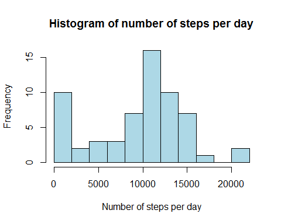
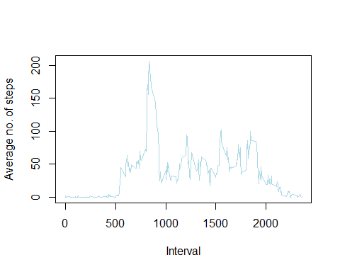
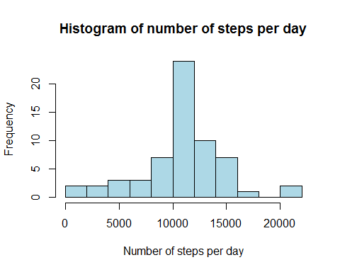
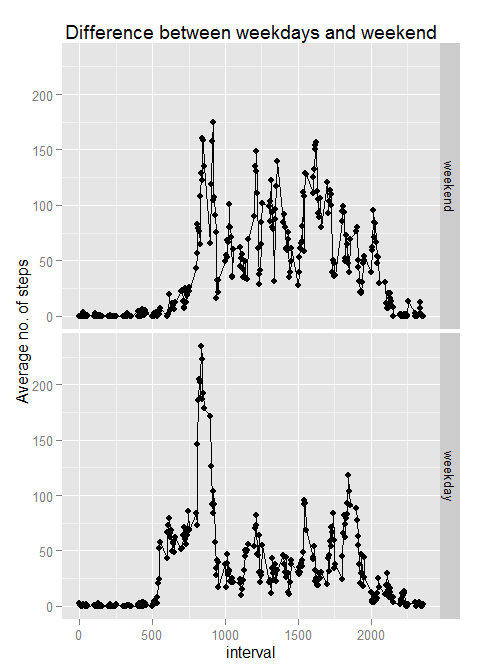

# Reproducible Research: Peer Assessment 1


## Loading and preprocessing the data

#### 1. Load the data (i.e. `read.csv()`)

First we'll try to load the data from .csv file (which is saved in our working directory) and take a look:


```r
file <- "activity.csv"
csv <- read.csv(file, stringsAsFactors = FALSE)
str(csv)
```

```
## 'data.frame':	17568 obs. of  3 variables:
##  $ steps   : int  NA NA NA NA NA NA NA NA NA NA ...
##  $ date    : chr  "2012-10-01" "2012-10-01" "2012-10-01" "2012-10-01" ...
##  $ interval: int  0 5 10 15 20 25 30 35 40 45 ...
```

#### 2. Process/transform the data (if necessary) into a format suitable for your analysis

As we can see, `date` component is loaded as a character type, while time (`interval`) component is loaded as a numeric. With fallownig code, we will join these columns into a new one of type POSXct:


```r
dateTime <- paste(csv$date, formatC(csv$interval, width=4, flag="0"))
dateTime <- strptime(dateTime, "%Y-%m-%d %H%M")
csv <- cbind(dateTime, csv)
names(csv)[1] <- "dateTime"
```

After this, we have a clean data with POSIXct intervals in `dateTime` variable:


```r
str(csv)
```

```
## 'data.frame':	17568 obs. of  4 variables:
##  $ dateTime: POSIXct, format: "2012-10-01 00:00:00" "2012-10-01 00:05:00" ...
##  $ steps   : int  NA NA NA NA NA NA NA NA NA NA ...
##  $ date    : chr  "2012-10-01" "2012-10-01" "2012-10-01" "2012-10-01" ...
##  $ interval: int  0 5 10 15 20 25 30 35 40 45 ...
```

## What is mean total number of steps taken per day?

#### 1. Calculate the total number of steps taken per day

For this assignemnt, we will group data by date using `dplyr` package:


```r
library(dplyr)
grouped <- group_by(csv, date)
```

Now we can extract summary of steps per day:


```r
summary <- summarise(grouped, SumOfStepsPerDay = sum(steps, na.rm = TRUE))
```

#### 2. If you do not understand the difference between a histogram and a barplot, research the difference between them. Make a histogram of the total number of steps taken each day

Histogram of a data:


```r
hist(summary$SumOfStepsPerDay, breaks=15, col="lightblue", 
     main="Histogram of number of steps per day", xlab="Number of steps per day")
```

 

#### 3. Calculate and report the mean and median of the total number of steps taken per day

Mean and median:


```r
mean(summary$SumOfStepsPerDay)
```

```
## [1] 9354.23
```

```r
median(summary$SumOfStepsPerDay)
```

```
## [1] 10395
```

## What is the average daily activity pattern?

#### 1. Make a time series plot (i.e. type = "l") of the 5-minute interval (x-axis) and the average number of steps taken, averaged across all days (y-axis)

First, we need to group data by the 5-minute intervals and summarise with mean function:


```r
groupedByIntervals <- group_by(csv, interval)
summaryByIntervals <- summarise(groupedByIntervals, AvgOfStepsPerInterval = mean(steps, na.rm = TRUE))
```

Now we can plot:


```r
plot(summaryByIntervals$interval, summaryByIntervals$AvgOfStepsPerInterval, 
     type="l", col="lightblue", xlab="Interval", ylab="Average no. of steps")
```

 

#### 2. Which 5-minute interval, on average across all the days in the dataset, contains the maximum number of steps?


```r
summaryByIntervals[summaryByIntervals$AvgOfStepsPerInterval == max(summaryByIntervals$AvgOfStepsPerInterval), ]["interval"]
```

```
## Source: local data frame [1 x 1]
## 
##   interval
## 1      835
```

## Imputing missing values

#### 1. Calculate and report the total number of missing values in the dataset (i.e. the total number of rows with NAs)


```r
nrow(csv[is.na(csv$steps), ])
```

```
## [1] 2304
```

#### 2. Devise a strategy for filling in all of the missing values in the dataset. The strategy does not need to be sophisticated. For example, you could use the mean/median for that day, or the mean for that 5-minute interval, etc.

We will use the summaryByIntervals data frame to populate missing values with average values for a given interval.

#### 3. Create a new dataset that is equal to the original dataset but with the missing data filled in.

We will copy a dataset in a new variable `csv2` and run a simple function that will substitute missing values with averages:


```r
csv2 <- csv
for(r in 1:nrow(csv2)) { 
    if (is.na(csv2[r,]$steps)) { 
        csv2[r,]$steps = 
            summaryByIntervals[
                summaryByIntervals$interval == csv2[r, ]$interval, ]$AvgOfStepsPerInterval 
    }
}
```

#### 4. Make a histogram of the total number of steps taken each day and Calculate and report the mean and median total number of steps taken per day. Do these values differ from the estimates from the first part of the assignment? What is the impact of imputing missing data on the estimates of the total daily number of steps?

As before, we group data by date:


```r
grouped2 <- group_by(csv2, date)
```

We extract summary of steps per day:


```r
summary2 <- summarise(grouped2, SumOfStepsPerDay = sum(steps, na.rm = TRUE))
```

Histogram of a data:


```r
hist(summary2$SumOfStepsPerDay, breaks=15, col="lightblue", 
     main="Histogram of number of steps per day", xlab="Number of steps per day")
```

 

Mean and median:


```r
mean(summary2$SumOfStepsPerDay)
```

```
## [1] 10766.19
```

```r
median(summary2$SumOfStepsPerDay)
```

```
## [1] 10766.19
```

There is much less days with total number of steps equal to 0. In turn, there are much more days that have average number of steps. Overall average of number of steps per day has incrised.


## Are there differences in activity patterns between weekdays and weekends?

#### 1. Create a new factor variable in the dataset with two levels – “weekday” and “weekend” indicating whether a given date is a weekday or weekend day.


```r
wd <- as.POSIXlt(csv$dateTime)$wday
factWd <- as.numeric((wd > 0 & wd < 6))
factWd <- factor(factWd)
levels(factWd) <- c("weekend", "weekday")
csv <- cbind(csv, factWd)
head(csv)
```

```
##              dateTime steps       date interval  factWd
## 1 2012-10-01 00:00:00    NA 2012-10-01        0 weekday
## 2 2012-10-01 00:05:00    NA 2012-10-01        5 weekday
## 3 2012-10-01 00:10:00    NA 2012-10-01       10 weekday
## 4 2012-10-01 00:15:00    NA 2012-10-01       15 weekday
## 5 2012-10-01 00:20:00    NA 2012-10-01       20 weekday
## 6 2012-10-01 00:25:00    NA 2012-10-01       25 weekday
```

#### 2. Make a panel plot containing a time series plot (i.e. type = "l") of the 5-minute interval (x-axis) and the average number of steps taken, averaged across all weekday days or weekend days (y-axis). See the README file in the GitHub repository to see an example of what this plot should look like using simulated data.


```r
library(ggplot2)
    
groupedByIntervals2 <- group_by(csv, factWd, interval)
summaryByIntervals2 <- summarise(groupedByIntervals2, AvgOfStepsPerInterval = mean(steps, na.rm = TRUE))
par(mfcol=c(1,2))
p <- qplot(interval, 
           AvgOfStepsPerInterval, 
           data=summaryByIntervals2) + 
            facet_grid(factWd ~ .) + geom_point(shape=1) + 
             geom_line(linetype="solid", size = 0.1) + 
            labs(title="Difference between weekdays and weekend", y="Average no. of steps")
print(p)
```

 

```r
head(summaryByIntervals2)
```

```
## Source: local data frame [6 x 3]
## Groups: factWd
## 
##    factWd interval AvgOfStepsPerInterval
## 1 weekend        0              0.000000
## 2 weekend        5              0.000000
## 3 weekend       10              0.000000
## 4 weekend       15              0.000000
## 5 weekend       20              0.000000
## 6 weekend       25              3.714286
```


